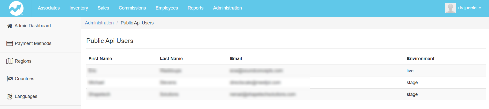
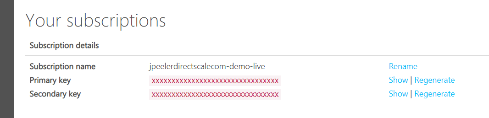
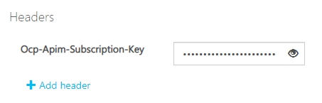
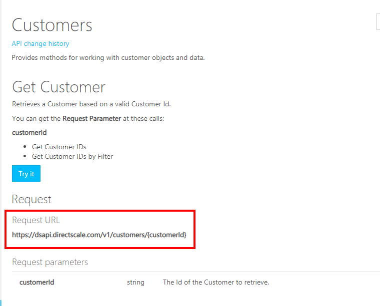
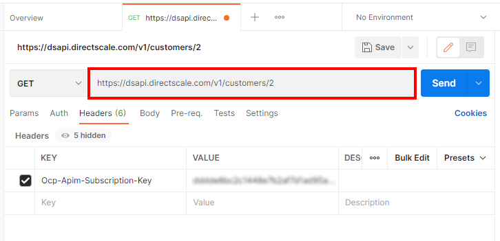
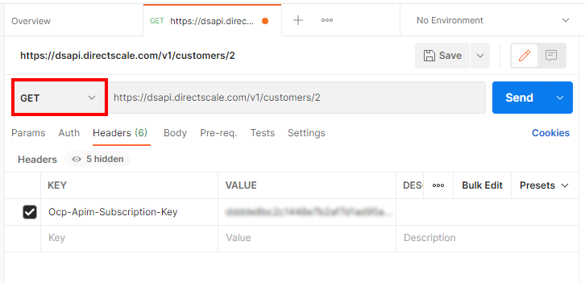
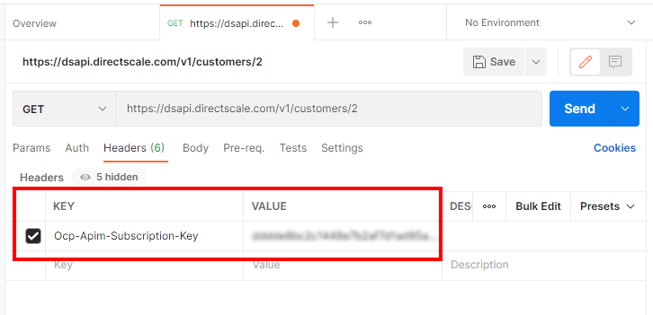
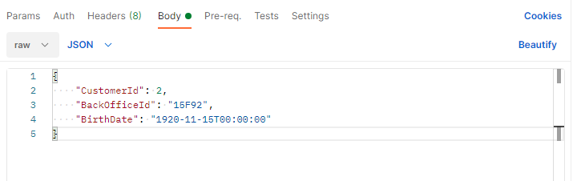
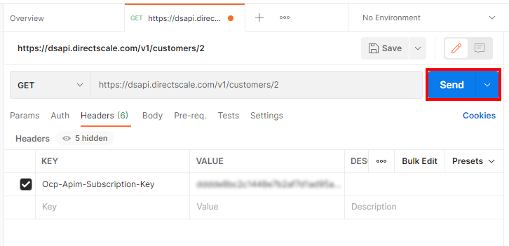
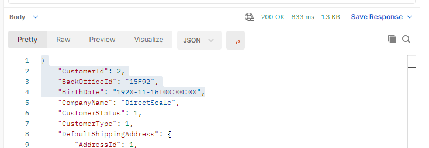

# `API Guide` Getting started with DirectScale's API

???+ example "Meta"

    DirectScale didn't have any API docs outside of the code generated reference docs through Azure's API Gateway. Client developers needed on how to start using the API. With that in mind, I wanted to create a simple overview of the API and provide developers to means to get started with the API as quickly as possible. The full plan was to build out a more user-friendly API doc and test site, but alas I was unable to see the project fully realized.

    This sample provides the developers a high-level view of the API and some steps to make that initial call with Postman.

## Overview

The Public API is a RESTful service that accepts JSON requests. With it, you can create intuitive integrations and additional functionality not present in the standard DirectScale Platform. Need to integrate with a logistics provider or eCommerce platform, create a custom enrollment experience, or import inventory? You can accomplish all of these and more with the Public API. 

### Environments

The DirectScale Platform has both *Live* and *Stage* environments. The Public API has separate keys for these environments.

- *Live* site base API URL - `https://dsapi.directscale.com/v1`.
- *Stage* site base API URL - `https://dsapi-stage.directscale.com/v1`.


### Verbs

The endpoints are set up in a customer-centric way with sensibly use of the HTTP verbs.

- `GET` - To retrieve
- `POST` - To create
- `DELETE` - To delete
- `PUT` - To update
- `PATCH` - To update by named parameter

### Call structure

We've kept the call structure simple. Take the `Customers` API for example. It has a call structured with the Customer ID in the URL:

```
https://dsapi.directscale.com/v1/customers/{customerId}/
```

You’ll see most of the calls based on a particular customer account are in the `Customers` API. You can manage customer-related orders, AutoShips, payment methods, services, stats, service log entries, and reset passwords in this same way with this URL structure:

`https://dsapi.directscale.com/v1/customers/{customerId}/orders` or `autoships` or `paymentmethods`, and so on.

Any call that you've not performed with customer accounts themselves are in more standard groupings:

Name | Route | Description
---|---|---
[Address]() | `/address/` | Basic address data.
[Custom Services]() | `/custom/` | An authenticated means of calling your custom-written APIs.
[Office]() | `/office/` | Web Office functions, including “Forgot Password”.
[Orders]() | `/orders/` | When a call operates on an order ID or related entities (like AutoShips), you’ll find it here, with the same HTTP verbs as in Customers where it makes sense.
[Products]() | `/products/` | All things inventory-related.
[Single Sign-On]() | `/sso/` | Although a Web Office function, this call is frequently used. Not currently OAuth. Learn more about Single Sign-On (SSO).
[Validate]() | `/validate/` | Use this to leverage the login functionality, as well as useful form validation functions.

## Authorization

Authorization to the Public API requires an invitation. Talk with your client contact (or security admin) to work with Customer Care to create an API account for you. 

### Signing up for an account

1. Your client contact must email [support@directscale.com](#). Partner or third-party developers must have their company request on their behalf.

1. You'll need access to:
    - [apigateway.directscale.com](#) - *Live*
    - [apigateway-stage.directscale.com](#) - *Stage*

    The API Gateway sites feature API Documentation, a testing tool, and a profile containing your API Keys.

2. For safety and efficiency, Customer Care needs specific information:
    - The first and last name of the person receiving access.
    - The email address of the person receiving access.
    - A basic message to begin your request.
    - Your company’s client ID.
    - Which environment to give access to *Live*, *Stage*, or *both*.
    - Partners or third-party developers must provide proof that the company authorizes access. It's best to do this through email. 
    
        Screenshots of company approval will do but must show it came from the company. *This is to maintain security compliance*.

### Access to the DirectScale Platform

If you’re a 3rd party developer, speak with your client contact to create an admin account for you on the DirectScale Corporate Admin. It has *Stage* and *Live* environments. You can access it at: 

- `{client_ID].corpadmin.directscale.com` for *Live*
-  `{client_ID].corpadmin.directscalestage.com` for *Stage*.

Knowing how DirectScale works is essential to understanding what the API is doing and how to validate what you post.

### Keeping track of API users

Your Corporate Admin keeps track of your authorized Public API users. 



To view, navigate to **Administration** > **Public Api Users**.

```
{client_ID}.corpadmin.directscale.com/Corporate/Admin/AzureResourceManagement/PublicApiUsers
```

## Getting your API Keys

Azure controls authentication for the Public APIs. DirectScale assigns you to particular clients. After you're added and authorized to your client product, your `Ocp-Apim-Subscription-Key` API Key will be available in your API Gateway Profile. 

### Locating Your API Keys

To locate your **Ocp-Apim-Subscription-Key** API Key:

1. Go to [apigateway.directscale.com/developer](#).
2. Select your name at the top, right corner and choose *PROFILE*.
3. On your Profile page, under **Your subscriptions**, you'll find your API Subscription Keys.

    

The DirectScale Platform has both *Live* and *Stage* environments. You have separate keys for these environments. The API Key links your calls to your specific back-end client. For those who service multiple back-end clients, you’ll have multiple unique keys. 

### Headers

For authentication, pass your API Key in the header of your requests as shown in the following examples:

=== "curl"

    ```curl
    curl --request GET \
        --url https://dsapi.directscale.com/v1/customers/299/countries \
        --header 'Accept: application/json' \
        --header 'Ocp-Apim-Subscription-Key: dedfe8bc2c1448e7b2af7d1ad95a03c4'
    ```

## Making your first call with Postman

Postman is a popular API testing tool. We recommend trying out several DirectScale Public API endpoints to get of feel for them before using them in your source code. With this guide, you'll learn how to create a basic call with Postman.

### Prerequisites

1. Locate your API Key. You can find your **Ocp-Apim-Subscription-Key** in your Profile or the **Try It** section of the API Documentation Site.

    

1. In the API Docs, note the verb (`GET`, `POST`, `PUT`, `PATCH`, and `DELETE`) used.

1. Find the **Request URL** of the call you’d like to make.

    

1. Note the endpoint's **Request Parameters** (for example, `{customerId}`). You’ll be inserting the parameter values in the URL as part of the call.

    

### Creating a request

Open [Postman](https://web.postman.co/) and [create a new request](https://learning.postman.com/docs/sending-requests/requests/).

1. Paste the **Request URL** and enter any **Request Parameters** in the URL.

    

1. Choose the proper verb from the dropdown.

    

1. Under **Headers**:

    

    1. In **KEY**, enter "*ocp-apim-subscription-key*"
    1. In **VALUE**, enter your secret API Key.

1. Leave all other settings to the default.

1. If doing a non-`GET` call, add a JSON request body.

    

    1. In the API Docs, copy the endpoint's request body.
    1. In Postman, click the **Body** tab.
    1. Select the dropdown and choose *raw*.
    1. From **Language**, choose *JSON*.
    1. Paste the request body.

1. Select **Send**. 

    

    If successful, the response body will appear.

    