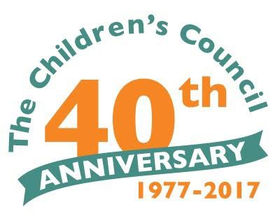
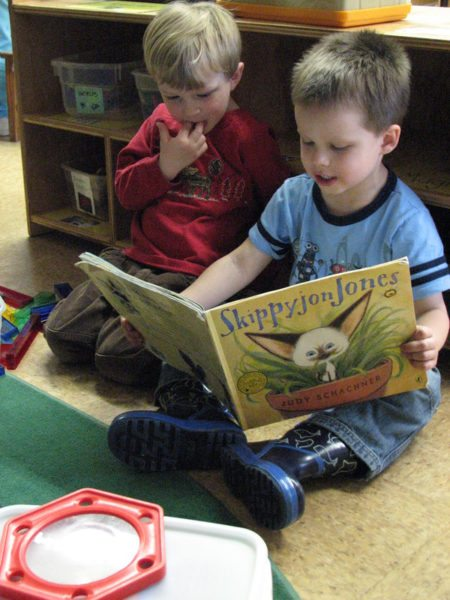
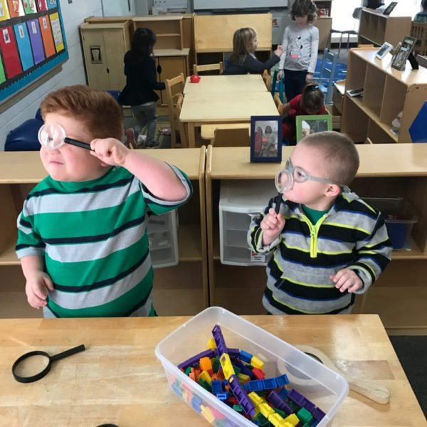
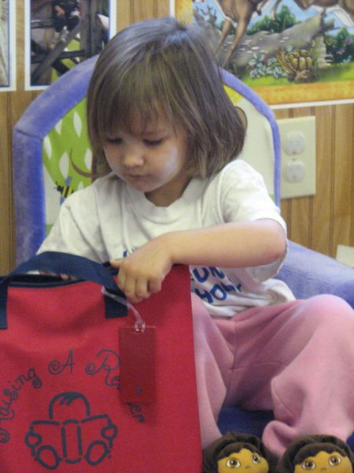
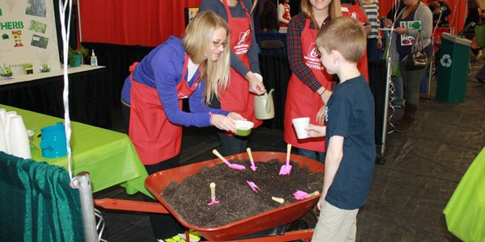

# Starting them off right: the Children’s Council of Watauga County and how you can help

???+ example "Meta"

    * **Tool**: Microsoft Word
    * **Company**: High Country Press/Appalachian State University
    * **Published**: [https://www.hcpress.com/front-page/people-helping-people-series-asu-students-fifth-article-explores-childrens-council-watauga-county.html](https://www.hcpress.com/front-page/people-helping-people-series-asu-students-fifth-article-explores-childrens-council-watauga-county.html)

In a small office nestled across from the Watauga Medical Center, the Children’s Council of Watauga County sits unassumingly. Inside the office is a cozy reading area filled with children’s and parenting books, as well as people working tirelessly to make a bigger impact in the community than the modest office might let on.

One of these people is Mary Scott, program and outreach coordinator. She knows firsthand why the work of the Children’s Council is important and wants you to know what you could be doing to better your community.

Celebrating its 40th anniversary this year, the Children’s Council has been helping make Watauga County a community that fosters early child development and prepares new parents for the stresses of parenthood in many ways.  

“Children are our future.” That may be a cheesy sentiment from a Whitney Houston song, but it is true nonetheless, and the Children’s Council was founded with a fervent devotion to giving children the future they deserve. Focusing specifically on Watauga County, its cornerstones are early childhood development and family support. Its family support wing offers families in need resources that make raising a child a little easier.

“It’s hard becoming a parent — trying to figure out how to handle a new baby and all the issues that entail. It’s exciting. It’s a wonderful time, but it’s challenging trying to figure it out,” Scott said.

Scott said there is so much to learn about the health, safety, and development of children that raising them can be a difficult time in life for the average parent.

“There’s a lot of families that come here that need additional resources and have questions about what’s normal and what’s not normal. So, we try to connect them with our services and others in the community as needed,” Scott said.  

The Children’s Council also serves as a hub for the [Who Needs a Change? Diaper Bank](https://sites.google.com/site/whoneedsachange/home), through which families can receive a free pack of diapers every month. While they’re in the office to pick up diapers, they can also learn about some of the other programs that are offered.

“We offer Triple P parenting support and The Incredible Years, which are parenting support programs,” Scott said. “A lot of it is just having a sounding board to talk through different issues they are going through with their children and with other parents who are going through the same thing.”

One of the oldest nonprofits in the area, the Children’s Council was started in 1977 as a grassroots effort focusing mainly on childcare centers. It was not long until it became the county’s official Smart Start agency, which directly funds Quality Support Programs and childcare centers.

“We have been growing since 1977 and now have a family support focus, as well. We saw the need to expand — to offer more services that would benefit children,” Scott said.

One of the areas of expansion comes in the form of [“Nurtured Beginnings,”](http://www.thechildrenscouncil.org/nurtured-beginnings.html) a new program started this year that specifically helps families with newborns up to 12 weeks old. It enables a postpartum specialist to visit the family up to three times in their home for free and bring a meal from [Green Street Catering](http://www.greenstreetcatering.org/) or [F.A.R.M. Cafe](http://farmcafe.org/), as well as a hand-knitted hat for the baby. They also speak with the new parents about the child’s development and screen the parents to identify and help avoid any kind of postnatal anxiety or depression.

The Children’s Council also does a lot for local teachers, especially teachers involved with early education who need certain training to operate and teach in a childcare center.

“We offer professional development to help teachers set goals and to move the needle to get them where they need to be,” Scott said.

The Children’s Council currently has six full-time staff members and 6 part-time staff members who work hard to support local children in their development years. However, it relies on many volunteers who are willing to help in any way they can, and it offers several avenues where one can help, including internships for university students.

Volunteers are invaluable to this agency, and — to make it easier to connect with the organization — a website is in the works that will break down different projects people can take on.

So, if you want to help, what kind of services can you volunteer? For one: the knitted caps for the babies. Groups of people may choose to get together and work on knitting caps for the children or providing some of the many other needs.

“We have needs for the childcare centers. We’re working on a project where people can build a water or sand table for childcare centers. We would provide the plans and they could build them on their own if they want to,” Scott said.

The Children’s Council also leads community-wide diaper drives. In the past, Appalachian State University student groups, as well as local churches, have participated. In 2014, Boone local Sam Walker used the crowdfunding website [GoFundMe to raise over $500 to buy diapers](https://www.gofundme.com/7v3n0s). All the diapers for the diaper bank come from volunteers pulling them together and donating them. Last year, more than 60,000 diapers were given out to families in need.

The Children’s Council serves its community, but it also needs a lot of support from the community. This mutually beneficial relationship is made evident every year with the organization’s annual Party with a Purpose event.

“We are looking for business donor partners, and we would definitely like to see more community support. Investing in the organization, which in turn is investing in the children during the most important time developmentally in a person’s life, is critical,” Scott said.

The help from local businesses and community members directly goes to offer programs for families and children in the area and allows the agency to add new programs as necessary.

“We like to keep a pulse on what the needs are and adjust our programs accordingly,” Scott said.

An example of a new program that was started by “keeping a pulse” on the community needs is [D.U.A.L. School](http://www.thechildrenscouncil.org/dual-school.html), a preschool that is half Spanish speaking children and half English speaking children. The teacher speaks both languages, allowing the children to learn from one another.

Another program of note is [the Dolly Parton Imagination Library](https://imaginationlibrary.com/), which gives children up to the age of 5 free access to one book every month.

“So, they can build a whole library in their home. That’s all from community support to cover the cost of these books,” Scott said.

“This time in a child’s life is so important in terms of brain development and forming connections,” Scott said. “We want to help parents to know how to interact with their children and to understand what they are going through developmentally. It is so important that children have a good, healthy home life and that preschool is a good quality experience.”

For more information about the Children’s Council of Watauga County, visit its [website](http://www.thechildrenscouncil.org/).

More information about The Children’s Council and upcoming programs you can support:

* The Week of the Young Child (April 22-29):

    * **Monday, April 24** – Open House at The Children’s Council 1 - 4 p.m.
    * **Tuesday, April 25** – Preschool Teacher Appreciation Day.
    * **Wednesday, April 26** – Breakfast of Champions 7:45 - 8:45 a.m.  RSVP required.
    * **Thursday, April 27** – The Playhouse will be offering free admission today if you bring in a pack of diapers for the Children’s Council Diaper Bank. Also, Margie Mansure from the Watauga County Agricultural Extension office will be hosting a healthy smoothie making class for families at the Playhouse.  
    * **Saturday, April 29** – The Children and Baby Fair of the High Country 9 -12 p.m. at the National Guard Armory in Boone.  Family fun! After Party at The Cardinal, where 10 percent of proceeds will go to the Children’s Council.

* The annual signature fundraiser, Party with A Purpose, will be held on Sunday, June 25 from 2 - 5 p.m. at the Green Park Inn in Blowing Rock. Tickets must be purchased before the event.  

For more information about the Children’s Council’s programs or events:

Address: 225 Birch St. Suite #3, Boone, NC 28607

Phone: 828-262-5424
