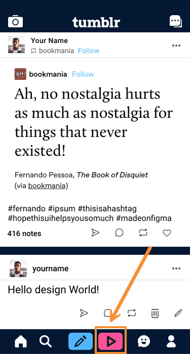
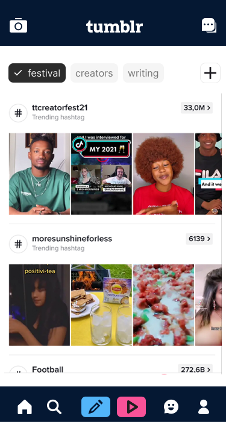
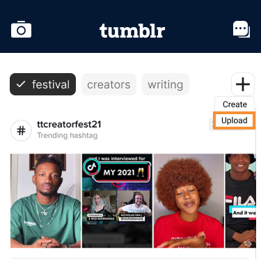
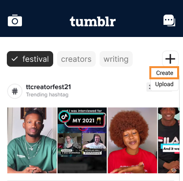
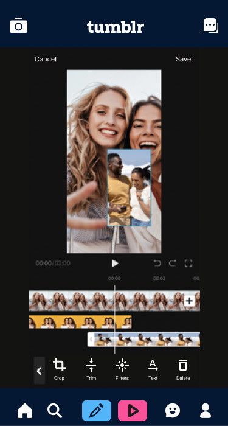

With **Tumblr Loops**, you can upload and share short videos (up to 90 seconds). Use the built-in **Tumblr Cam** to create the Loops right in the app, or you can upload them from your device. Share the Loops with your friends or post them to your blog for all your followers.

**On this page**

- [Requirements](#requirements)

- [Discovering Loops](#discovering-loops)

- [Uploading Loops](#uploading-loops)

    - [Uploading from your device](#uploading-from-your-device)

    - [Creating new Loops](#creating-new-loops)

    - [Editing Loops](#editing-loops)

- [Posting Loops](#posting-loops)

    - [Sharing Loops with friends](#sharing-loops-with-friends)

    - [Posting Loops to your followers](#posting-loops-to-your-followers)

## Requirements

To post, share, and view **Tumblr Loops**, you need:

- [x] The [latest version of the **Tumblr** app (`v2.1.3`)](#) installed on your device

- [x] An [active **Tumblr** account](#)

- [x] To grant the **Tumblr** app permission to use your device's Camera and Microphone

Ensure your Loops are:

- [x] No longer than 90 seconds

- [x] A vertical aspect ratio

- [x] An upload size of less than 80 MBs

## Discovering Loops

With your **Loop Feed**, view Loops from the creators you currently follow or discover new ones.

From your **Tumblr** app, tap :material-play-outline:.

{width="200px"}

Your **Loop Feed** loads where you can watch other's shared Loops.

{width="200px"}

## Uploading Loops

Upload a video from your device or create a new Loop using the **Tumblr Cam**.

### Uploading from your device

To upload a video:

1. From your **Tumblr** app, tap :material-play-outline:.

1. Tap :material-plus: and choose *Upload*.

    {width="300px"}

1. With the resulting **File Finder**, choose the video you want to upload.

1. Tap **Open**.

### Creating new Loops

To create a Loop:

1. From your **Tumblr** app, go to **:material-play-outline:**.

1. Tap **:material-plus:** and choose *Create*.

    {width="300px"}

1. From the **Tumblr Cam**, tap **:material-record-circle: Record** to begin recording. 

    !!! warning "Reminder"
        You must grant the Tumblr app permission to use your device's Camera and Microphone to create Loops.
    
    !!! note
        The recording will stop automatically once 90 seconds has elapsed.

1. To stop recording, tap **:material-stop:**. The recorded video opens in the **Loop Editor**.

### Editing Loops

To edit a Loop:

1. From the **Loop Editor**, edit the video using the built-in tools:

    {width="250px"}

    - To crop the aspect ratio, tap **:material-crop: Crop**. Drag the handles to crop the video to fill the screen.

    - To trim the duration, tap **:material-format-vertical-align-center: Trim**. Drag from either end of the timeline to choose the start and end point.

    - To add built-in filters, tap **:material-flare: Filters**.

    - To add text, tap **:material-format-text-rotation-none: Text**.
    
    - To delete a Loop, tap **:material-delete: Delete**.

1. Tap **Save**.

## Posting Loops

Share your Loops with your friends or post them to your followers.

### Sharing Loops with friends

To share a Loop privately:

1. With your Loop open, tap **:material-share-variant: Share**.

1. From the resulting **Friends List**, choose the recipients.

1. Add a **Message**.

1. Tap **Send**. Your Loop is shared privately to your chosen friends.

### Posting Loops to your followers

To post a Loop:

1. With your Loop open, tap **:octicons-globe-16: Post**.

1. Add a **Message**.

1. Tap **Post**. Your Loop shows up in your follower's **Loop Feed** and as suggested content to potential new followers.
