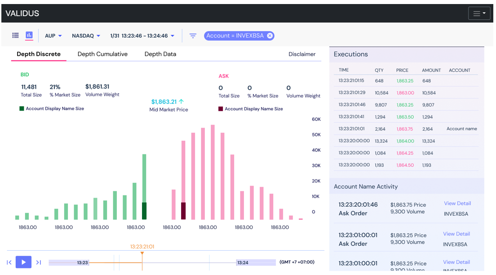
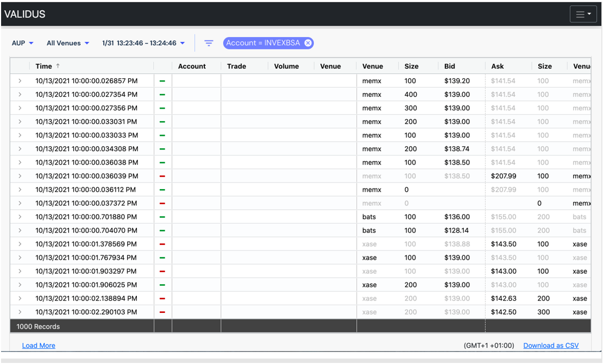
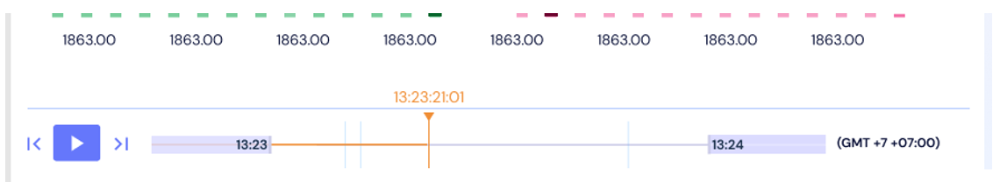
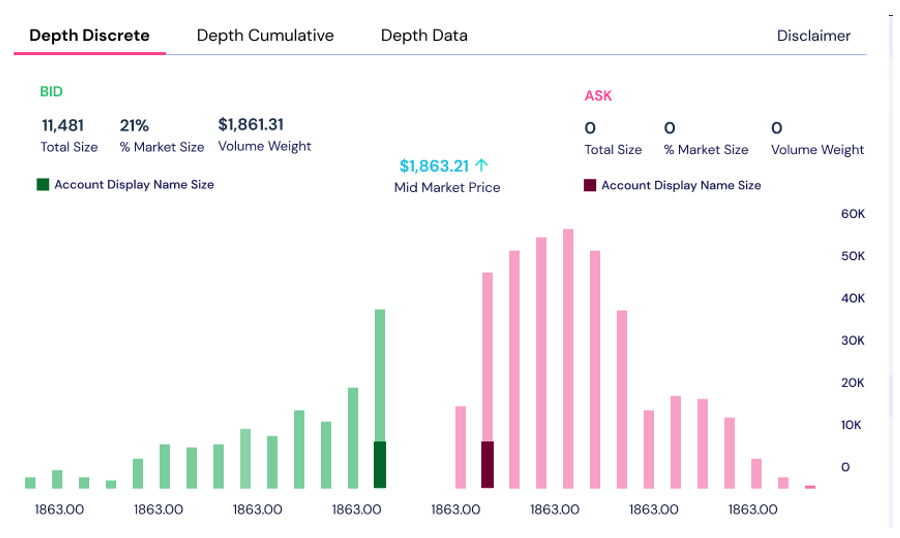
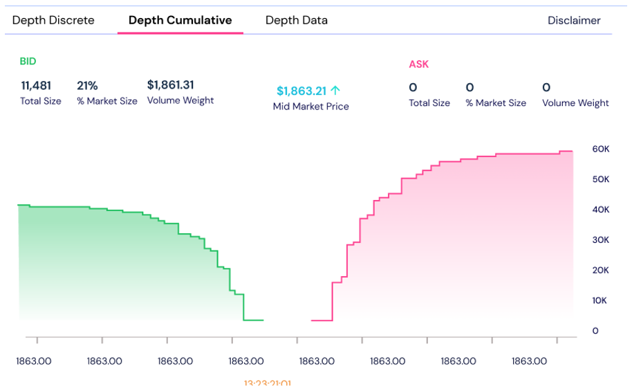
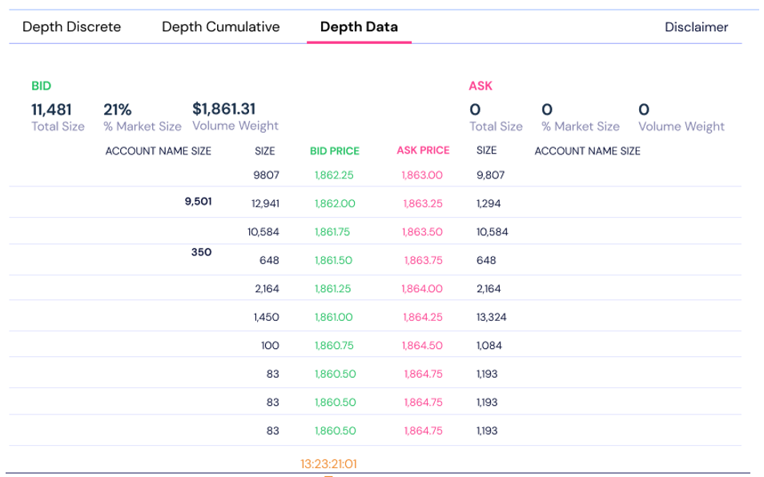
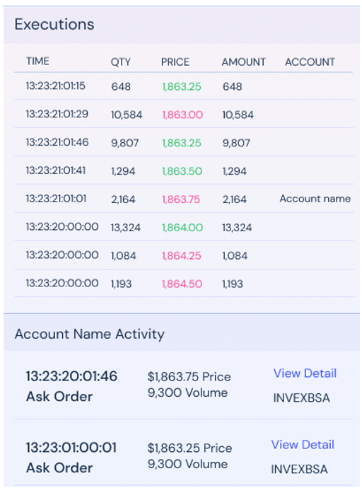

# `New` Order Book Replay

???+ example "Meta"
    * **Tool**: Zendesk
    * **Company**: Eventus
    * **Published**: In internal Zendesk Help Center

Validus' **Order Book Replay** gives you the ability to watch the market action of an account by playing back a previous trading session using an interactive timeline. You can see how an account's activity relates to market depth and midmarket price. 

**Order Book Replay** lets you see market depth, along with certain alerts to determine if the market is being manipulated.

* Play through a timeline for an alert
* Step through filtered internal activity
* Choose from three chart modes (Depth Discrete, Depth Cumulative, and Depth Data)
* Utilize conditional filters to narrow down to the most important information

See the [Features](#features).

## Release Phases

A three-phased rollout of **Order Book Replay** is planned: 

* **Phase One**
  
    Before **Order Book Replay** is officially released, we are making some additional updates to the existing **Time + Sales Viewer** to lay the groundwork. 
    
    With Phase One, the **Time + Sales Viewer** is getting a visual upgrade as shown in the following image. Additionally, an improved filtering menu is being added that you can access by clicking . 

    

    !!! note
        Phases One and Two will include Level One data only.

* **Phase Two**

    The official release of **Order Book Replay**. Within the **Order Book Replay** interface, you’ll be able to:

    * Toggle between different chart modes
    * Use an interactive timeline with pause and play buttons
    * Filter data
    * Easily distinguish between internal and market data
  
* **Phase Three**

    Update to feature Level Two data. If your system does not feature Level Two data, you can contact your Customer Success Manager to purchase an upgrade.

## Getting Started

Order Book Replay is not enabled by default. If you’d like to enable this feature, contact your Customer Success Manager. 

## Features

### Player

Using the Player, you can play or pause the Order Book Replay. The Player displays the time based on your filter selection. 

By scrubbing the timeline with your mouse, you can adjust your location in the replay. The fast forward and fast backward buttons step you to the next filtered account(s) activity and pauses the player at that time. 

### Depth Charts

**Depth Discrete**: Shows the market size across any given order book price

**Depth Cumulative**: Show the cumulative size/spread of the order book

**Depth Data**: A table that lists out the exact figures of size at each price

!!! note
    Both **Discrete** and **Cumulative** modes show the mid-market price and an arrow next to it will indicate whether the price is trending up or down.

### Executions and Internal Activity

In the **Executions** and **Account Name Activity** areas, you can view external and internal order book data. You can drag and expand/minimize the account activity area as needed. 

The **Account Name Activity** area is labeled to match the chosen filter. 

Click the **View Detail** link to open another browser tab to the **Time + Sales Viewer** for that specific activity.
