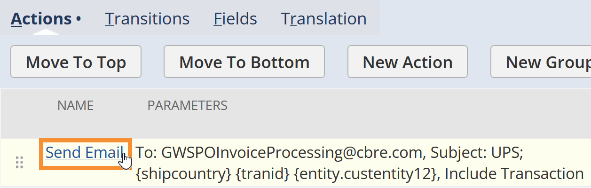

# `SOP` Initiating bulk email invoices for UPS

???+ example "Meta"

    With Waste Harmonics, my role was to write Standard Operating Procedures (SOPs) for each department because there was a common issue: employees weren't performing their duties consistently and new employees weren't being trained effectively. At the start, there weren't really any official, existing SOPs--just rough documents of notes and vague processes. Training was handled by employees shadowing other employees until they were up to speed.
    
    As many of the employees had enough on their plates, I decided the best approach to creating the SOPs was to write them myself using a mixture of SME interviews, gaining general product and process knowledge that applied to every department, and gathering any notes or documents that current existed. I designed a template, configure the authoring tool (MadCap Flare), and built the internal knowledge base (SharePoint) where the SOPs could be accessed (as PDFs). 
    
    As of now, I've written well over a hundred SOPs, which have been well-received and used as the source-of-truth to create learning modules and other training materials. 
    
    This sample demonstrates how my typical SOPs flow. I wrote it for the Business Intelligence team. It was a process that only the manager knew how to do. Now, he can delegate the task to anyone else on the team. 
    
    The final result was a PDF with a document layout and design of my own creation, follow the link below to see the original PDF.

    [:fontawesome-solid-file-pdf: View original PDF](../assets/pdfs/Emailing%20Invoices%20in%20Bulk%20for%20UPS.pdf){ .md-button }

__Standard Operating Procedure__

Department | Version | Publish date
---|---|---
Business Intelligence | 1.0 | 6/20/2024

## Purpose

This document details the process of initiating a bulk send of invoice PDFs to UPS. 

After Accounts Receivable have changed the Sales Orders' statuses to "Ready to Invoice", the AR Manager will create a case requesting the bulk invoices be sent, including with the applicable date range.

=== "Access"

    - [x] NetSuite *Waste Harmonics Administrator Jr* role.

=== "Resources"

    *N/A*

## Procedure

### 1. Update the saved search

1. In the NetSuite **Global Search Bar**, enter "*sea: ups email send*" and select **Edit** on the suggestion.

    { width=500 } 

2. Under **Criteria**, update the **Date** filter to the requested date range.
   
    { width=500 } 

3. Optionally, update any other fields.
4. Select **Save**.

### 2. Update the workflow

1. Go to **Customization** > **Workflow** > **Workflows**.
2. Find the *UPS Invoice Send* workflow and select **Edit**.
3. In the **Workflow** sidebar, select **Edit** (). 

    The Workflow window opens.

    { width=500 }  

4. Under **Schedule**:

    1. For **SAVED SEARCH FILTER**, choose *UPS Email Send*.
    2. For **EXECUTION DATE**, choose the current date.
    3. For **EXECUTION TIME**, choose a time in the afternoon for best results.

5. If any other fields were requested, update them as needed.
6. Select **Save**.

### 3. Update the workflow state

1. Under **Workspace**, select the **State 1** box.

    { width=400 }  

2. In the **State** sidebar, select **Edit** (). 

    The Workflow State window opens.

    { width=500 }  

3. Under **Actions**, select **Send Email**.

    { width=400 }  

    The Workflow Action window opens.

    { width=500 }  

4. Under **Schedule**, for **START TIME**, match the time you selected for **EXECUTION TIME** on the workflow.
5. Under **Sender**:

    1. Select the **SPECIFIC SENDER** checkbox.
    2. For **SENDER**, link the Employee Record from whom the emails will send.

6. Under **Recipient**, in **EMAIL**, enter the receiving customer's email address.
7. Under **Content**:

    1. Select the **CUSTOM** checkbox.
    2. In **SUBJECT**, enter the subject template.

        ???+ note
            Some customers have specific formats the **SUBJECT** must adhere to.
    
    3. In **BODY**, enter any applicable information.

8. Under **Attachment**:

    1. Select the **INCLUDE TRANSACTION** checkbox.
    2. For **TYPE**, choose *PDF*.

9.  Select **Save** on the workflow action.
10. Select **Save** on the workflow state.
11. Wait for the workflow to run.

### 4. Verify the run

1. Go to the customer's page.
2. Go to **Sales** > **Transactions** and open an invoice.
3. On the invoice, go to **Communication** > **Messages**. If successful, you'll see the generated email.